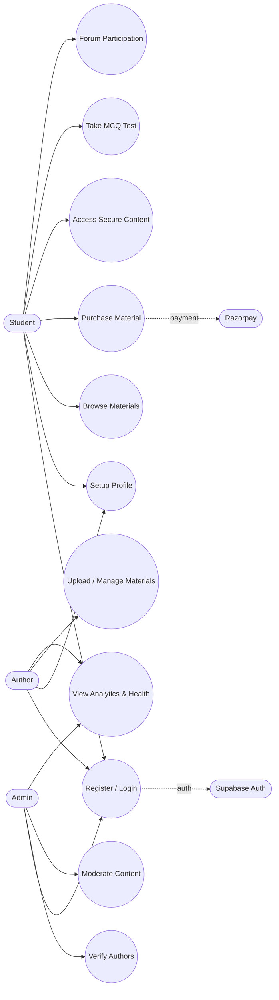
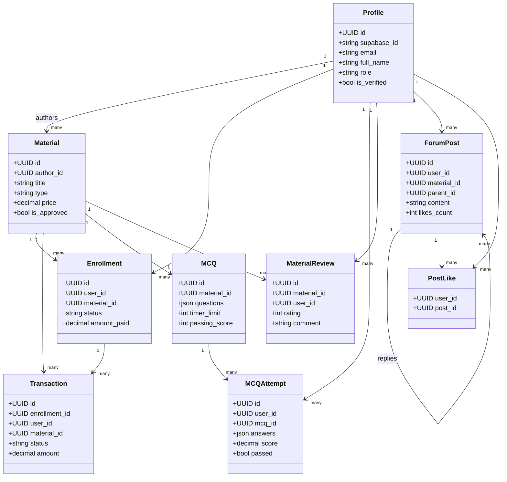
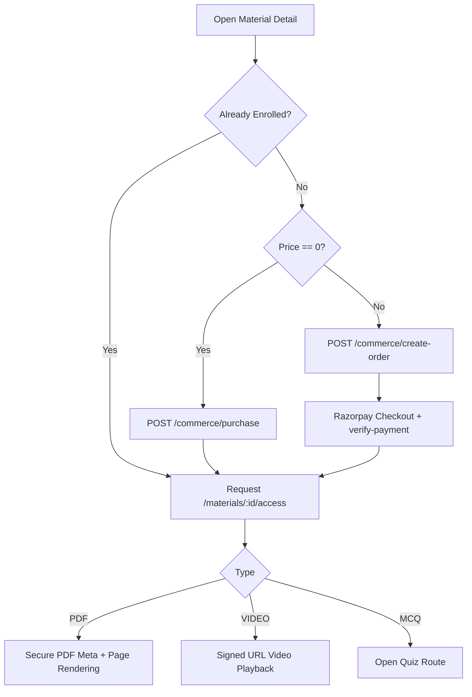
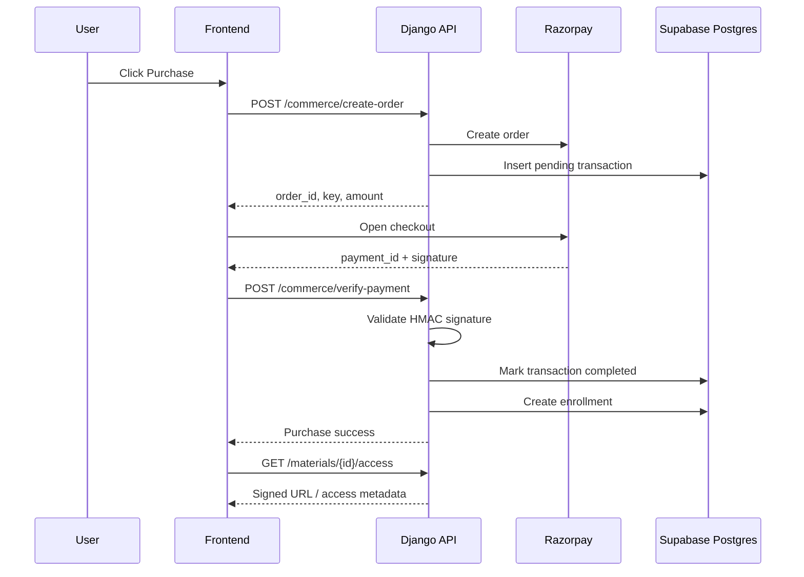
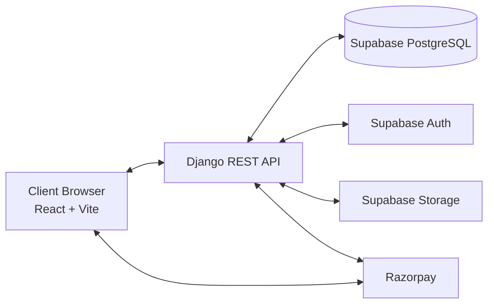
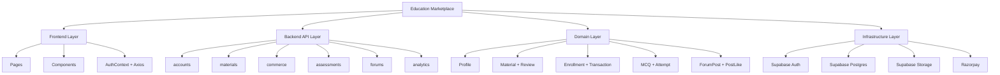

# Education Marketplace - Software Engineering Documentation

## 1. Project Overview
### Purpose
Education Marketplace is a role-based digital learning marketplace and LMS where:
- Students discover, purchase, and consume study materials.
- Authors publish and monetize educational content.
- Admins moderate content/users and monitor platform analytics.

### Problem It Solves
The project addresses fragmented distribution of curriculum-specific resources by combining:
- Marketplace discovery (filters by university/course/semester/category).
- Secure post-purchase access (signed URLs and protected viewers).
- Assessment and community features (MCQ tests, forums).
- Operational controls (author verification, moderation, analytics, health checks).

### Main Objective
Deliver an end-to-end, secure, scalable education content ecosystem with clear RBAC, payment flow integration, and analytics-backed administration.

---

## 2. Technology Stack
### Frontend
- React 19 (`react`, `react-dom`)
- Vite 8 (`vite`, `@vitejs/plugin-react`)
- React Router 7 (`react-router-dom`)
- Tailwind CSS 4 via Vite plugin (`tailwindcss`, `@tailwindcss/vite`)
- Axios for API client and interceptors
- Recharts for dashboard charts
- Framer Motion for animations
- Lucide React for icons

### Backend
- Django 5.x
- Django REST Framework (DRF)
- Custom authentication backend for Supabase JWT (`accounts.authentication.SupabaseAuthentication`)
- `django-cors-headers`

### Database
- Supabase PostgreSQL is the actual primary database used for the project.
- Django reads it through `DATABASE_URL` (Supabase connection string).
- Codebase also contains a SQLite fallback (`db.sqlite3`) for local/dev fallback.

### External Services
- Supabase Auth (JWT issuer + JWKS validation)
- Supabase Storage (private bucket upload + signed URLs)
- Razorpay (order creation + signature verification)
- Optional SMTP provider (health-check integration)

### ML/AI Libraries
- No ML/AI inference libraries are used.

---

## 3. Complete Folder Structure Explanation
## Root
- `backend/`: Django API server.
- `frontend/`: React web client.
- `Proj_Spec.md`: product/problem statement.

## backend/
- `manage.py`: Django CLI entrypoint.
- `requirements.txt`: backend dependencies.
- `.env.example`: backend environment contract.
- `db.sqlite3`: local development DB.

### backend/config/
- `settings.py`: app configuration, DB selection logic, DRF defaults, Supabase and CORS config.
- `urls.py`: API gateway routing (`/api/auth`, `/api/materials`, etc.).
- `asgi.py`, `wsgi.py`: deployment entrypoints.

### backend/accounts/
- `models.py`: `Profile` entity and role system.
- `authentication.py`: JWT verification against Supabase JWKS.
- `permissions.py`: RBAC policies (`IsAdmin`, `IsVerifiedAuthor`, etc.).
- `serializers.py`: profile and setup payloads.
- `views.py`: profile CRUD-lite, author verification, admin user management.
- `urls.py`: account/auth API routes.

### backend/materials/
- `models.py`: `Material`, `MaterialReview`.
- `serializers.py`: list/detail/create/admin serializers and file metadata processing.
- `storage.py`: Supabase upload + signed URL helper.
- `views.py`: marketplace listing, author CRUD, moderation, secure access, secure PDF rendering.
- `migrations/`: schema evolution.

### backend/commerce/
- `models.py`: `Enrollment`, `Transaction`.
- `views.py`: free purchase, Razorpay checkout, payment verification, library, history, enrollment check.
- `serializers.py`: enrollment/transaction payloads.
- `urls.py`: commerce routes.

### backend/assessments/
- `models.py`: `MCQ`, `MCQAttempt`.
- `serializers.py`: author/student quiz payload separation.
- `views.py`: quiz creation, retrieval, submission, grading, attempts listing.
- `urls.py`: assessment routes.

### backend/forums/
- `models.py`: `ForumPost`, `PostLike` with thread + reaction support.
- `views.py`: listing/search/filtering, post CRUD, likes, stats.
- `serializers.py`: post/reply serializers.
- `urls.py`: forum routes.

### backend/analytics/
- `views.py`: admin/author analytics and chart endpoints.
- `health_checks.py`: platform service probes (server/db/storage/payments/email).
- `urls.py`: analytics routes.

## frontend/
- `package.json`: scripts + dependencies.
- `vite.config.js`: dev proxy and port config.
- `.env.example`: frontend environment contract.
- `README.md`: frontend setup documentation.

### frontend/src/
- `main.jsx`: React root mount.
- `App.jsx`: router map and protected route wiring.
- `context/AuthContext.jsx`: Supabase session lifecycle + backend profile bootstrapping.
- `lib/api.js`: axios instance with JWT attach + 401 handling.
- `lib/supabase.js`: Supabase client creation.

#### frontend/src/pages/
- `Home.jsx`: landing page.
- `Login.jsx`, `Register.jsx`: authentication and profile setup UX.
- `Marketplace.jsx`, `MaterialDetail.jsx`: discovery + checkout flow.
- `MyLibrary.jsx`: enrolled content + reviews + forums/bookmarks surface.
- `QuizPage.jsx`: MCQ test taking/submission UI.
- `ForumPage.jsx`: community posting and interactions.
- `AuthorDashboard.jsx`: author content management + analytics.
- `AdminPanel.jsx`: moderation, verification, user management, analytics, health.
- `SecurePdfViewer.jsx`, `SecureVideoViewer.jsx`: protected consumption views.
- `PrivacyPolicy.jsx`, `TermsOfService.jsx`: legal pages.

#### frontend/src/components/
- `auth/`: route guard and auth layout.
- `author/`: material form modal, MCQ builder.
- `admin/`: user and author management sections.
- `assessments/`: quiz runner and score summary.
- `marketplace/`: cards/filter controls.
- `layout/`: navbar/footer.
- `animations/`: scroll/canvas animation utilities.

---

## 4. Functional Modules
1. Authentication and Session Module
- Supabase sign-up/sign-in/sign-out.
- Session sync into localStorage token.
- Backend profile bootstrap (`/auth/me`, `/auth/setup`).

2. RBAC and Profile Module
- Roles: `STUDENT`, `AUTHOR`, `ADMIN`.
- Verification gate for authors (`is_verified`).
- Frontend route-level role protection.

3. Marketplace Module
- Public catalog listing with filters and sorting.
- Material detail with author stats, tags, reviews.

4. Content Publishing Module (Author)
- Verified authors upload PDF/VIDEO assets and metadata.
- MCQ authoring for materials of type `MCQ`.

5. Commerce Module
- Free enrollment path.
- Paid Razorpay two-step order/verify flow.
- Enrollment ownership checks and transaction logs.

6. Secure Content Delivery Module
- Signed URLs via Supabase Storage.
- PDF secure page rendering with dynamic watermark.
- Video access through signed links and restricted controls.

7. Assessment Module
- Quiz serving without exposing answer keys.
- Server-side grading and attempt persistence.
- Attempt history retrieval.

8. Community Forum Module
- Threaded top-level posts and replies.
- Likes toggle.
- Search/filter/sort and community stats.

9. Administration and Moderation Module
- Author verification/unverification.
- User listing/filtering/deletion.
- Content approval/rejection.

10. Analytics and Health Module
- Admin overview KPIs, revenue/user charts.
- Author performance analytics.
- Runtime health checks for core services.

---

## 5. Database Schema
### Table: `accounts_profile`
- `id` (UUID, PK)
- `supabase_id` (varchar, unique, indexed)
- `email` (email)
- `full_name` (varchar)
- `role` (enum text: STUDENT/AUTHOR/ADMIN)
- `university` (varchar)
- `bio` (text)
- `avatar_url` (url)
- `is_verified` (bool)
- `verification_docs_url` (url)
- `created_at`, `updated_at`

### Table: `materials_material`
- `id` (UUID, PK)
- `author_id` (FK -> `accounts_profile.id`)
- `title`, `description`, `about_material`
- `type` (PDF/VIDEO/MCQ)
- `price` (decimal)
- `file_path`, `thumbnail_url`
- `university`, `category`, `course`, `semester`
- `tags` (JSON)
- `page_count`, `topics_covered`
- `level`, `language`
- `file_size_bytes`
- `is_approved`, `is_published`
- `total_sales`, `average_rating`
- `created_at`, `updated_at`

### Table: `materials_materialreview`
- `id` (UUID, PK)
- `material_id` (FK -> `materials_material.id`)
- `user_id` (FK -> `accounts_profile.id`)
- `rating` (1..5)
- `comment`
- `created_at`
- Unique constraint: (`material_id`, `user_id`)

### Table: `commerce_enrollment`
- `id` (UUID, PK)
- `user_id` (FK -> `accounts_profile.id`)
- `material_id` (FK -> `materials_material.id`)
- `purchase_date`
- `status` (ACTIVE/EXPIRED/REFUNDED)
- `payment_ref`
- `amount_paid`
- Unique constraint: (`user_id`, `material_id`)

### Table: `commerce_transaction`
- `id` (UUID, PK)
- `enrollment_id` (nullable FK -> `commerce_enrollment.id`)
- `user_id` (FK -> `accounts_profile.id`)
- `material_id` (FK -> `materials_material.id`)
- `amount`
- `status` (PENDING/COMPLETED/FAILED/REFUNDED)
- `payment_method`
- `payment_ref`
- `created_at`

### Table: `assessments_mcq`
- `id` (UUID, PK)
- `material_id` (OneToOne FK -> `materials_material.id`)
- `questions` (JSON list)
- `timer_limit`
- `passing_score`
- `total_questions`
- `created_at`, `updated_at`

### Table: `assessments_mcqattempt`
- `id` (UUID, PK)
- `user_id` (FK -> `accounts_profile.id`)
- `mcq_id` (FK -> `assessments_mcq.id`)
- `answers` (JSON dict)
- `score`
- `total_correct`, `total_questions`
- `passed`
- `time_taken`
- `started_at`, `completed_at`

### Table: `forums_forumpost`
- `id` (UUID, PK)
- `user_id` (FK -> `accounts_profile.id`)
- `material_id` (nullable FK -> `materials_material.id`)
- `title`, `content`
- `parent_id` (nullable self FK -> `forums_forumpost.id`)
- `post_type` (QUESTION/DISCUSSION)
- `topic` (General/Books/Study/Exam)
- `is_pinned`
- `likes_count`
- `created_at`, `updated_at`

### Table: `forums_postlike`
- `id` (implicit PK)
- `user_id` (FK -> `accounts_profile.id`)
- `post_id` (FK -> `forums_forumpost.id`)
- `created_at`
- Unique constraint: (`user_id`, `post_id`)

### Relationship Summary
- One `Profile` -> many `Material`, `Enrollment`, `Transaction`, `MCQAttempt`, `ForumPost`, `PostLike`, `MaterialReview`.
- One `Material` -> many `Enrollment`, `Transaction`, `ForumPost`, `MaterialReview`.
- One `Material` -> one `MCQ` (when type is MCQ).
- One `ForumPost` -> many reply `ForumPost` via self-reference.

---

## 6. API Documentation
Base path: `/api`

### Auth/Profile (`/auth`)
1. `GET /auth/me/`
- Auth: required
- Purpose: current user profile
- Response: full profile serializer

2. `PUT/PATCH /auth/me/`
- Auth: required
- Body: profile editable fields
- Purpose: update current profile

3. `POST /auth/setup/`
- Auth: required
- Body: `full_name`, `role`, `university?`, `bio?`, `verification_docs_url?`
- Purpose: complete post-signup profile setup

4. `GET /auth/profile/{uuid}/`
- Auth: required
- Purpose: public profile view

5. `GET /auth/authors/?verified=&search=`
- Auth: admin
- Purpose: author verification queue

6. `POST /auth/authors/{uuid}/verify/`
- Auth: admin
- Body: `action` = `approve|reject|unverify`
- Purpose: verify/unverify author

7. `GET /auth/admin/users/?role=&verified=&search=&status=`
- Auth: admin
- Purpose: global user management list

8. `DELETE /auth/admin/users/{uuid}/`
- Auth: admin
- Purpose: delete user profile

### Materials (`/materials`)
1. `GET /materials/`
- Public
- Query: `university, category, course, semester, type, search, level, min_price, max_price, sort`
- Purpose: marketplace listing

2. `GET /materials/{uuid}/`
- Public
- Purpose: material detail

3. `GET /materials/{uuid}/access/`
- Auth: enrolled user/author/admin
- Purpose: signed URL or access metadata

4. `GET /materials/{uuid}/pdf/meta/`
- Auth: enrolled user/author/admin
- Purpose: secure PDF page count metadata

5. `GET /materials/{uuid}/pdf/page/{page_num}/`
- Auth: enrolled user/author/admin
- Purpose: rendered PNG page with server watermark

6. `POST /materials/{uuid}/reviews/`
- Auth: required
- Body: `rating`, `comment?`
- Purpose: create/update user review and refresh average rating

7. `GET /materials/my/`
- Auth: verified author
- Purpose: list own materials

8. `POST /materials/my/`
- Auth: verified author
- Body: multipart/json metadata + files
- Purpose: create/publish material

9. `GET/PATCH/DELETE /materials/my/{uuid}/`
- Auth: verified author owner
- Purpose: manage own material

10. `GET /materials/admin/list/?approved=`
- Auth: admin
- Purpose: moderation list

11. `POST /materials/admin/{uuid}/moderate/`
- Auth: admin
- Body: `action` = `approve|reject`
- Purpose: moderation decision

### Commerce (`/commerce`)
1. `GET /commerce/library/`
- Auth: required
- Purpose: enrolled materials list

2. `GET /commerce/transactions/`
- Auth: required
- Purpose: user payment history

3. `GET /commerce/check/{material_id}/`
- Auth: required
- Purpose: enrollment boolean

4. `POST /commerce/purchase/`
- Auth: required
- Body: `material_id`
- Purpose: direct purchase flow for free materials

5. `POST /commerce/create-order/`
- Auth: required
- Body: `material_id`
- Purpose: create Razorpay order for paid material

6. `POST /commerce/verify-payment/`
- Auth: required
- Body: `razorpay_order_id`, `razorpay_payment_id`, `razorpay_signature`, `material_id`
- Purpose: verify payment and create enrollment

### Assessments (`/assessments`)
1. `POST /assessments/create/`
- Auth: verified author
- Body: MCQ set payload
- Purpose: create MCQ set

2. `GET/PATCH /assessments/{mcq_id}/`
- Auth: verified author owner
- Purpose: retrieve/update MCQ set

3. `GET /assessments/{mcq_id}/take/`
- Auth: enrolled/author
- Purpose: quiz payload without correct answers

4. `POST /assessments/{mcq_id}/submit/`
- Auth: required
- Body: `answers`, `time_taken`
- Purpose: grade and save attempt

5. `GET /assessments/material/{material_id}/take/`
- Auth: enrolled/author
- Purpose: material-id-based quiz fetch

6. `POST /assessments/material/{material_id}/submit/`
- Auth: required
- Purpose: material-id-based submission

7. `GET /assessments/my-attempts/`
- Auth: required
- Purpose: attempts history

### Forums (`/forums`)
1. `GET /forums/stats/`
- Public
- Purpose: aggregate forum counters

2. `GET /forums/`
- Auth optional (supports mine/following filters if authenticated)
- Query: `material, search, post_type, topic, mine, unanswered, following, sort`
- Purpose: list top-level posts

3. `POST /forums/`
- Auth: required
- Body: `title?`, `content`, `material?`, `parent?`, `post_type`, `topic`
- Purpose: create post/reply

4. `GET/PATCH/DELETE /forums/{post_id}/`
- Auth: owner/admin for write
- Purpose: post details and management

5. `POST /forums/{post_id}/like/`
- Auth: required
- Purpose: toggle like state

### Analytics (`/analytics`)
1. `GET /analytics/admin/overview/` (admin)
2. `GET /analytics/admin/revenue/?granularity=day|month&days=&period=` (admin)
3. `GET /analytics/admin/users/?days=` (admin)
4. `GET /analytics/admin/health/` (admin)
5. `GET /analytics/author/` (author)

---

## 7. Application Workflow
1. User authenticates with Supabase in frontend (`signUp/signIn`).
2. Frontend gets Supabase access token and stores `access_token` in localStorage.
3. Axios interceptor attaches bearer token to all backend requests.
4. Backend `SupabaseAuthentication` validates token via JWKS and maps/creates `Profile`.
5. Frontend calls `/auth/me/` and `/auth/setup/` to initialize role/profile.
6. Public users browse `/materials/` and open `/materials/{id}/`.
7. Student purchase path:
- Free: `POST /commerce/purchase/` -> Enrollment + completed transaction.
- Paid: `POST /commerce/create-order/` -> Razorpay checkout -> `POST /commerce/verify-payment/` -> enrollment.
8. Access path:
- Frontend checks `/commerce/check/{id}/`.
- Content access via `/materials/{id}/access/`.
- PDF viewer fetches `/pdf/meta/` then per-page rendered PNG `/pdf/page/{n}/`.
9. Assessment path:
- Student fetches `/assessments/material/{id}/take/`.
- Submits answers to `/submit/`, backend grades and stores `MCQAttempt`.
10. Community path:
- Users post/reply/like through forum APIs.
11. Author path:
- Verified author uploads material files and metadata through `/materials/my/`.
- For MCQ materials, author creates MCQ set via `/assessments/create/`.
12. Admin path:
- Moderates authors/content and monitors analytics and service health.

---

## 8. Class/Object Structure
### Backend Domain Classes (Django Models)
- `Profile`
- `Material`
- `MaterialReview`
- `Enrollment`
- `Transaction`
- `MCQ`
- `MCQAttempt`
- `ForumPost`
- `PostLike`

### Service/Behavior Classes
- `SupabaseAuthentication` (extends DRF `BaseAuthentication`)
- `SupabaseUser` (lightweight authenticated principal wrapper)
- DRF generic view classes (`ListAPIView`, `RetrieveAPIView`, etc.) used across modules

### Frontend Objects/State Containers
- `AuthProvider` context object with methods: `signUp`, `signIn`, `signOut`, `setupProfile`, `fetchProfile`.
- `api` Axios singleton with request/response interceptors.
- Route components as object boundaries for modules (Marketplace, AuthorDashboard, AdminPanel, etc.).

### Inheritance and Composition
- Inheritance:
- Django models inherit `models.Model`.
- Permissions inherit `permissions.BasePermission`.
- API views inherit DRF generic base classes.
- Composition:
- `Material` composes with `MaterialReview`, `Enrollment`, `Transaction`, `ForumPost`, `MCQ`.
- Frontend pages compose reusable components (`FilterBar`, `MaterialFormModal`, `QuizPlayer`, admin sections).

### Dependencies
- Accounts module is a dependency root for all role-aware modules.
- Commerce depends on Materials + Accounts.
- Assessments depends on Materials + Commerce + Accounts.
- Analytics depends on all domain modules.

---

## 9. UML Diagram Data
### A) Use Case Diagram Data
Actors:
- Student
- Author
- Admin
- Supabase Auth
- Razorpay

Use Cases:
- Register/Login (Student/Author/Admin via Supabase)
- Setup Profile
- Browse/Search Materials
- Purchase Material (Free/Paid)
- Access Secure Content
- Submit Review
- Take MCQ Test
- Participate in Forums
- Upload/Manage Materials (Author)
- Create MCQ Set (Author)
- Verify Authors (Admin)
- Moderate Materials (Admin)
- Manage Users (Admin)
- View Analytics/Health (Admin/Author)

### B) Class Diagram Data
Classes:
- Profile
- Material
- MaterialReview
- Enrollment
- Transaction
- MCQ
- MCQAttempt
- ForumPost
- PostLike

Associations:
- Profile 1..* Material (author)
- Profile 1..* Enrollment
- Material 1..* Enrollment
- Enrollment 1..* Transaction (optional linkage)
- Material 1..1 MCQ
- MCQ 1..* MCQAttempt
- Profile 1..* MCQAttempt
- ForumPost self-association (parent -> replies)
- Profile *..* ForumPost via PostLike

### C) Activity Diagram Data (Purchase + Access)
- Start
- User opens material detail
- Check enrollment
- Decision: already enrolled?
- If no, decision: price == 0?
- Free: create enrollment directly
- Paid: create order -> Razorpay checkout -> verify signature
- Create/update transaction + enrollment
- Request content access
- Backend verifies authorization + enrollment
- Generate signed URL or render PDF page
- Display content
- End

### D) Sequence Diagram Data (Paid Purchase)
Participants:
- User UI
- Frontend App
- Backend API
- Razorpay
- DB

Messages:
1. UI -> Frontend: click Purchase
2. Frontend -> Backend: `POST /commerce/create-order`
3. Backend -> DB: create pending transaction
4. Backend -> Razorpay: create order
5. Backend -> Frontend: order payload
6. Frontend -> Razorpay: open checkout
7. Razorpay -> Frontend: payment response
8. Frontend -> Backend: `POST /commerce/verify-payment`
9. Backend: verify HMAC signature
10. Backend -> DB: complete transaction + create enrollment
11. Backend -> Frontend: success
12. Frontend -> Backend: `GET /materials/{id}/access/`
13. Backend -> Frontend: signed URL/access metadata

### E) Deployment Diagram Data
Nodes:
- Browser Client (React app)
- Django API Server
- Supabase Auth + Storage + Postgres (external managed services)
- Razorpay API

Connections:
- Browser <-> Django (HTTPS REST)
- Browser <-> Razorpay Checkout SDK
- Django <-> Supabase JWKS/Auth endpoint
- Django <-> Supabase Storage REST
- Django <-> Postgres (direct DB, or local SQLite in dev)

### F) Module Hierarchy Diagram Data
- Presentation Layer (React pages/components)
- Application Layer (DRF views, serializers, auth provider)
- Domain Layer (Django models: profile/material/commerce/assessment/forum)
- Infrastructure Layer (Supabase Auth/JWKS, Supabase Storage, Razorpay, DB)

---

## 10. Deployment Architecture
### Client Side
- React SPA served by Vite in dev (`localhost:5173`).
- Calls backend at `/api` using axios.
- Uses Supabase JS SDK for auth operations.

### Server Side
- Django REST API with custom Supabase JWT authentication.
- Stateless API using bearer tokens.

### Database Server
- Supabase PostgreSQL (managed cloud database) via `DATABASE_URL`.
- Local fallback SQLite is present in `settings.py` but not the primary deployed database.

### Cloud Services
- Supabase Auth (identity + token issuing).
- Supabase Storage (private assets, signed retrieval).
- Razorpay (payment order and capture verification).

### Storage Services
- Bucket path strategy: `authors/{author_id}/{content_folder}/{uuid.ext}` for materials.
- Thumbnails stored similarly under `thumbnails/`.

---

## 11. Security Features
1. Authentication
- JWT bearer authentication using Supabase-issued tokens.
- Tokens validated with JWKS key discovery and signature verification.
- Issuer and audience checks enforced.

2. Authorization
- Role-based permissions (`IsAdmin`, `IsAuthor`, `IsVerifiedAuthor`, `IsOwnerOrAdmin`).
- Protected frontend routes mapped to role constraints.

3. API Protection
- DRF default permission is authenticated unless endpoint is explicitly public.
- Owner checks for sensitive resource updates/deletes.

4. Content Protection
- Signed URLs for storage object access.
- Enrollment checks before issuing access.
- Secure PDF viewer uses server-side rasterization + dynamic watermark.

5. Payment Integrity
- Razorpay HMAC signature validation before enrollment issuance.
- Pending transaction state updated to failed/completed based on verification.

6. Data Validation
- DRF serializers enforce field-level validation and types.
- Material upload validation by file type and metadata constraints.

7. Session Hygiene
- 401 interceptor clears local tokens and triggers local sign-out.
- Auth storage cleanup in `AuthContext.signOut`.

---

## 12. Third Party Libraries and Purpose
### Backend
- `django`: web framework, ORM, migrations.
- `djangorestframework`: API layer, serializers, permissions, generic views.
- `django-cors-headers`: cross-origin configuration.
- `python-dotenv`: env loading.
- `PyJWT`: token parsing/validation.
- `requests`: external service calls (JWKS/storage/health).
- `PyMuPDF (fitz)`: secure PDF page rendering and page count extraction.
- `psycopg2-binary`: PostgreSQL driver.
- `razorpay` (used in code): payment gateway SDK.

### Frontend
- `react`, `react-dom`: UI runtime.
- `react-router-dom`: route management and navigation.
- `axios`: HTTP client with interceptors.
- `@supabase/supabase-js`: auth/session integration.
- `tailwindcss` + `@tailwindcss/vite`: styling pipeline.
- `lucide-react`: iconography.
- `recharts`: analytics visualizations.
- `framer-motion`: animation and transitions.

---

## 13. Project Workflow Summary (Viva/Interview Ready)
1. User authenticates via Supabase.
2. Frontend stores token and bootstraps profile from Django.
3. Marketplace exposes approved/published materials with dynamic filters.
4. Free material enrolls directly; paid material uses Razorpay order + verify flow.
5. Enrollment unlocks secure access endpoints.
6. PDFs are served as watermarked page images; videos via signed URLs.
7. MCQ tests are delivered without answer keys and graded server-side.
8. Forums provide engagement via posts, replies, likes.
9. Authors publish/manage content and monitor personal analytics.
10. Admins verify authors, moderate materials/users, and monitor platform health.

---

## 14. Engineering-Level Architecture Summary
This project follows a layered service-oriented monolith architecture:

- Presentation Layer: React SPA with route-level guards and context-based auth orchestration.
- API Layer: Django REST endpoints partitioned by bounded contexts (`accounts`, `materials`, `commerce`, `assessments`, `forums`, `analytics`).
- Domain Layer: Relational models capture users, content, ownership, payments, assessments, and social interactions with explicit foreign-key constraints.
- Security Layer: Custom Supabase JWT authentication, strict RBAC, and resource ownership checks enforce zero-trust API behavior.
- Integration Layer: External services (Supabase Auth/Storage, Razorpay) are encapsulated behind backend helpers and controlled endpoints.
- Observability/Operations Layer: analytics aggregation endpoints and health probes provide operational visibility.

Key engineering strengths:
- Clear module boundaries by Django app.
- End-to-end transactional workflow from browse -> pay -> enroll -> consume.
- Multi-role governance with verified-author gate.
- Secure digital content delivery posture for education assets.

Identified architectural considerations:
- `analytics` app currently has no model entities (view/service-only app), which is acceptable but should be documented for maintainers.
- `requirements.txt` should explicitly pin `razorpay` because it is imported in `commerce/views.py`.
- SQLite fallback is useful for local development but production should enforce PostgreSQL-only settings and harden secret handling.

---

## Mermaid UML Snippets

### Use Case Diagram

### Class Diagram

### Activity Diagram

### Sequence Diagram

### Deployment Diagram

### Module Hierarchy Diagram

